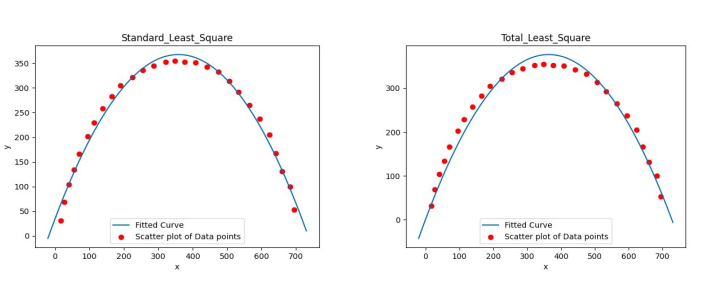
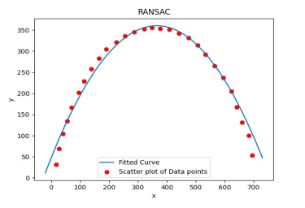
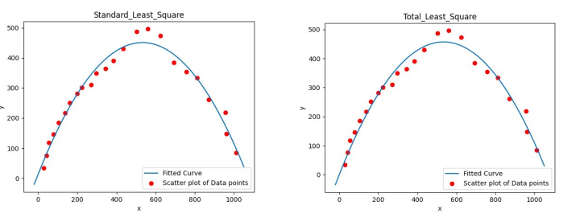
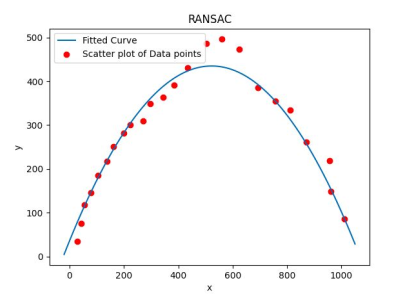

# Trajectory-Estimation-Of-A-Projectile
**Objective**: To fit the best curve for the ball’s trajectory using the input from two
different videos and compare different fitting methods on basis of efficiency, time of
execution and goodness of fit etc. For detailed report checkout [this link](https://github.com/savnani5/Trajectory-Estimation-Of-A-Projectile/blob/main/Documentation/ENPM673-%20HW1.pdf).


[Input videos](https://drive.google.com/drive/folders/1gggBKHrBkxIWk9W-foiG3sJGHKkgK0gu?usp=sharing)


### sls.py
a) This file has the standard least square function and it uses numpy for
matrix operations. To implement this function X and Y matrices are
created using the data points found from the video.

b) As the curve is a parabola the equation to fit the points will be
y = a x 2 + b x + c . Assuming n data points, the X matrix will be an n*3
matrix, having x 2 , x and 1 values in the columns and matrix Y will be an
n*1 matrix with y values. 

c) To find the least squares solution, we need to minimize the error equation
by equating its derivative to zero. So, we will end up the following
equation:
  
*(X.T)XB = (X.T)Y*

*B = (X.T*X)(X.T*Y)*

### tls.py

a) This file has the total least square function and it uses numpy and custom
built svd function to calculate the tls solution. To implement this function X
and Y matrices are created using the data points found from the video.

b) To fit the points using total least squares we will use c y = a x 2 + b x + d . Also,
assuming the data is passing through origin we will drop the constantvalue i.e the equation will be c y = a x 2 + b x. Assuming n data points, the X
matrix will be an n*2 matrix having x 2 and x values in the columns and
matrix Y will be an n*1 matrix with y values.

c) To find the solution we have to minimize the total least square error i.e we
will equate its derivative to zero and will find the final equation.

d) Now to construct the final matrix we will combine X and Y matrices and
assign them to Z, further we will find the Singular Value
Decomposition(SVD) of the Z matrix, which will give the decomposition of
combined matrix as:

*Z=U*Σ*V.T*

e) Transpose the V.T matrix to get the coefficients matrix V. Now, separate
the initial(a,b) and the last coefficient(c) from V. Finally, divide the initial
coefficients by c to get the final coefficients. Return them to the main.py
file.

### ransac.py

a) This file has the implementation of the RANSAC function and it uses
numpy, math, random, scipy libraries along with sls.py file.

b) For **N iterations** :-

● Select randomly a subset of s data points from the list of all data
points.

● Fit a model to those data points using std_least_square function(it
will fit perfectly, because we have 3 points).

● After fitting the model, solve the constraint optimization problem
using scipy for each point and find the distance from the point to the
curve.

● After finding the distance compare it with the threshold(t), if the
distance is less than t increment the inlier_count. Do this for all
points for a single model.

● Now, if the new model has the higher inlier_count update the
best_model
and
max_inlier_count
variables
with
result
and
inlier_count respectively.
  ○ best_model ← result

repeat.....

## Output

**Video without Noise**

For this video,standard least
squares technique gives the least
error(4500.34), and takes the least time to execute(0.0008s), whereas total least
squares takes more time(0.0019) and has a significant error(9128.40). Also, as the
RANSAC is a probabilistic model, its performance depends upon the number of
iterations(i.e parameters), so it gives varying results, also it takes a significant
amount of time to fit due to its high time complexity(~O( n 3 )). So, for the first
video **standard least squares** solution should be opted.







**Video with Noise**

The second video contains a lot of noise, thus it has many outliers present. Now,
standard least squares and total least squares methods don’t take outliers into
consideration and thus try to fit them into the curve, but the ransac method takes
them into consideration and rejects the outliers, to fit a better curve. Here,
although the RANSAC method takes some time to compute due to its high time
complexity, but it has the least error(7430.49), which makes it desirable for these
cases. (NOTE: The error is calculated after removing the outliers.) So, for the
second video **RANSAC algorithm** should be opted.






## How to run the code
1) Change the directory of input video file in the main1.py file
    ```PY
      video = "Ball_travel_10fps.mp4"
    ```

2) Run the main.py file.

### References
1) https://math.stackexchange.com/questions/494238/how-to-compute-homography-matrix-h-from-corresponding-points-2d-2d-planar-homog
2) https://docs.scipy.org/doc/scipy/reference/generated/scipy.optimize.fmin_cobyla.html
3) https://math.berkeley.edu/~hutching/teach/54-2017/svd-notes.pdf
4) https://opencv-python-tutroals.readthedocs.io/en/latest/py_tutorials/py_video/py_table_of_contents_video/py_table_of_contents_video.html#py-table-of-contentvideo
5) http://people.duke.edu/~hpgavin/SystemID/CourseNotes/TotalLeastSquares.pdf
6) https://www.youtube.com/watch?v=UKhh_MmGIjM


